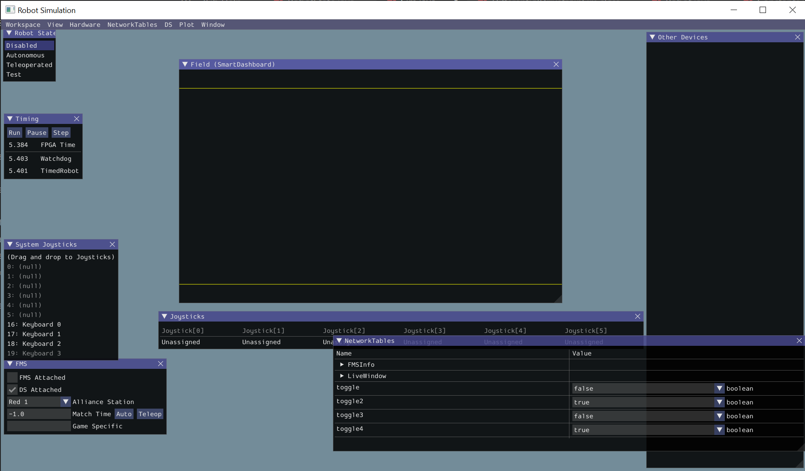

# Practice Drivetrain Simulation

## Step 1

Since we don't have a real drivetrain we need some representation of it in code in order to run our simulation. For a differential drivetrain (the type of drivetrain we used for our 2022 competition) we use the `DifferentialDrivetrainSim` class and pass in parameters that describe the physical characteristics of our particular robot:

```java
 public static DifferentialDrivetrainSim driveSim = new DifferentialDrivetrainSim(
            // Create a linear system from our identification gains.
            LinearSystemId.identifyDrivetrainSystem(Constants.KvLinear, Constants.KaLinear,
                    Constants.KvAngular,
                    Constants.KaAngular),
            DCMotor.getNEO(2), // 2 NEO motors on each side of the drivetrain.
            Constants.GEAR_REDUCTION, // 7.29:1 gearing reduction.
            Constants.TRACK_WIDTH, // The track width is 0.7112 meters.
            Constants.WHEEL_RADIUS, // The robot uses 3" radius wheels.
            // The standard deviations for measurement noise:
            // x and y: 0.001 m
            // heading: 0.001 rad
            // l and r velocity: 0.1 m/s
            // l and r position: 0.005 m
            VecBuilder.fill(0.001, 0.001, 0.001, 0.1, 0.1, 0.005, 0.005));
```

More on this can be found here: https://docs.wpilib.org/en/stable/docs/software/wpilib-tools/robot-simulation/drivesim-tutorial/drivetrain-model.html

## Step 2

Just like with a real drivetrain, our simulated drivetrain must take some input in order to change its current state. What are the inputs and how can we describe the current state of the drivetrain?

Once you have identified the inputs update the `Sim.update` method so it does the following:

1. Update the drivetrain simulation model by passing in the input values
2. Advance the model forward .02 seconds (the period of our robot loop)
3. Get the latest state from the model.

## Step 3

Having some code that describes our physical robot is great, but for the simulation to be useful we really need to see it changing on the screen. Run the simulator. You should see something like this:



The field's there but where's the robot?! To make the robot show up we need to add the following code to our `Robot.java` file:

```java

```

```java
private final Field2d field = new Field2d();

public void robotInit() {
  ...
  SmartDashboard.putData("Field", field);
}
```

We also need to keep track of our robot's position and update it in the field. We do that by create an odometry object for our differential drivetrain. More information on this can be found here: https://docs.wpilib.org/en/stable/docs/software/kinematics-and-odometry/differential-drive-odometry.html?highlight=odometry

We can then update the field2d robot in the sim by periodically calling this line:

```java
field.setRobotPose(odometry.getPoseMeters());
```


https://docs.wpilib.org/en/stable/docs/software/dashboards/glass/field2d-widget.html
